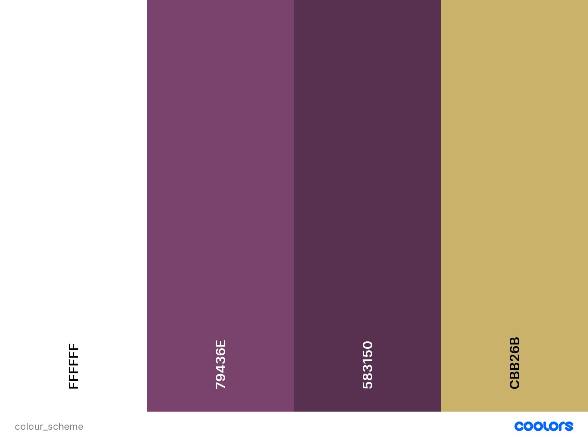

# **Angelika's Wedding Cakes**

## **Goal for this project**

Welcome to Angelika's Wedding Cakes!

This wedding cake shop is located in the heart of Chester, creating beautiful wedding cakes to help make your big day special.

This website includes all the relevant information you need as a visitor, all wrapped into an elegant and clear design.

An introduction of the business owner, photos of previous creations, customer reviews and an order/contact form are available for visitors.

The clear and user-friendly layout of the website provides easy access to all necessary information.

Thank you for visiting!

Should you have any questions regarding my project feel free to reach out to me via the provided GitHub contact details.

---
## Table of contents 
- [**Angelika's Wedding Cakes**](#angelikas-wedding-cakes)
  - [**Goal for this project**](#goal-for-this-project)
  - [Table of contents](#table-of-contents)
  - [**UX**](#ux)
    - [User Goals](#user-goals)
    - [User Stories](#user-stories)
    - [Site Owner's Goals](#site-owners-goals)
    - [Design Choices](#design-choices)
      - [Colours](#colours)
      - [Structure](#structure)

---
## **UX**

### User Goals

* A website containing valuable information about the company
* Website accessible and easy to use on desktop, tablet & mobile
* Appealing, creative and simple design
* Professional information about the company owner
* Availability of references, customer reviews and pictures of previous work
* Form to place an order through the website
* Easily available contact details and location map
* Direct links to the company's social media sites

[Back to Top](#table-of-contents)

### User Stories

* As a user, I want to be able to easily find information about the company and owner.
* As a user, I want to be able to easily find the contact details and place an order via the website.
* As a user, I want to see reviews, references and images about previous works.
* As a user, I want to find easily where the company is located.
* As a user, I want the website to have an elegant and easy to nagivate design.
* As a user, I want the website to be fully suitable for use on mobile phones and tablets as well as on desktop computers.
* As a user, I want to be able to acccess relevant social media links from the website, and expect these to open on separate tabs.

[Back to Top](#table-of-contents)

### Site Owner's Goals

* Advertise Wedding Cakes. 
* Establish online presence of the company.
* Increase and simplify orders via website.
* Showcase previous works and reviews of customers.
  
### Design Choices

The company is creating and selling wedding cakes, therefore the website's design choices reflect elegance and celebration. 

#### Colours

* FFFFFF: White is used as a primary background colour to provide good visibility for text and images.
* 79436E: The feature colour purple represent diversity, to make sure the design is equally appealing to all couples.
* 583150: A darker purple used for header and footer. 
* CBB26B: This golden colour represents luxury and celebrtation, present in the company logo.

The colour palette was created via [Coolors](https://coolors.co/ "Coolors.co").

#### Structure

The website's structure was created with the use of [Bootstrap](https://getbootstrap.com/) to ensure compatibility across various devices.
