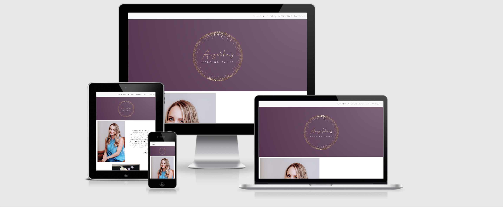
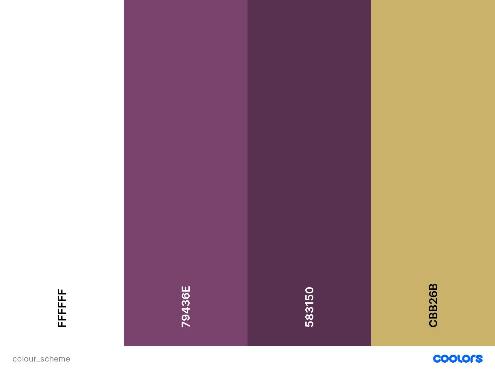

# **Angelika's Wedding Cakes**

## **Goal for this project**

Welcome to Angelika's Wedding Cakes!

This wedding cake shop is located in the heart of Chester, creating beautiful wedding cakes to help make your big day special.

This website includes all the relevant information you need as a visitor, all wrapped into an elegant and clear design.

An introduction of the business owner, photos of previous creations, customer reviews and an order/contact form are available for visitors.

The clear and user-friendly layout of the website provides easy access to all necessary information.

Thank you for visiting!

Should you have any questions regarding my project feel free to reach out to me via the provided GitHub contact details.

---
## Table of contents 
- [**Angelika's Wedding Cakes**](#angelikas-wedding-cakes)
  - [**Goal for this project**](#goal-for-this-project)
  - [Table of contents](#table-of-contents)
  - [**UX**](#ux)
    - [User Goals](#user-goals)
    - [User Stories](#user-stories)
    - [Site Owner's Goals](#site-owners-goals)
    - [Design Choices](#design-choices)
      - [Colours](#colours)
      - [Structure](#structure)
      - [Logo](#logo)
      - [Fonts](#fonts)
      - [Icons](#icons)
  - [**Wireframes**](#wireframes)
    - [Desktop Wireframe](#desktop-wireframe)
    - [Tablet Wireframe](#tablet-wireframe)
    - [Mobile Wireframe](#mobile-wireframe)
  - [**Features**](#features)
    - [Navigation bar](#navigation-bar)
    - [Home Section](#home-section)
    - [Introduction Section](#introduction-section)
    - [Gallery Section](#gallery-section)
    - [Reviews Section](#reviews-section)
    - [Order Section](#order-section)
    - [Contact Us Section](#contact-us-section)
  - [**Deployment**](#deployment)
  - [**Credits**](#credits)

---
## **UX**

### User Goals

* A website containing valuable information about the company
* Website accessible and easy to use on desktop, tablet & mobile
* Appealing, creative and simple design
* Professional information about the company owner
* Availability of references, customer reviews and pictures of previous work
* Form to place an order through the website
* Easily available contact details and location map
* Direct links to the company's social media sites

[Back to Top](#table-of-contents)

### User Stories

* As a user, I want to be able to easily find information about the company and owner.
* As a user, I want to be able to easily find the contact details and place an order via the website.
* As a user, I want to see reviews, references and images about previous works.
* As a user, I want to find easily where the company is located.
* As a user, I want the website to have an elegant and easy to nagivate design.
* As a user, I want the website to be fully suitable for use on mobile phones and tablets as well as on desktop computers.
* As a user, I want to be able to acccess relevant social media links from the website, and expect these to open on separate tabs.

[Back to Top](#table-of-contents)

### Site Owner's Goals

* Advertise Wedding Cakes. 
* Establish online presence of the company.
* Increase and simplify orders via website.
* Showcase previous works and reviews of customers.
  
### Design Choices

The company is creating and selling wedding cakes, therefore the website's design choices reflect elegance and celebration. 

#### Colours

* FFFFFF: White is used as a primary background colour to provide good visibility for text and images.
* 79436E: The feature colour purple represent diversity, to make sure the design is equally appealing to all couples.
* 583150: A darker purple used for header and footer. 
* CBB26B: This golden colour represents luxury and celebrtation, present in the company logo.

#### Structure

The website's structure is created with the use of [Bootstrap](https://getbootstrap.com/) to ensure compatibility across various devices.

#### Logo

The company logo is created via [Looka](https://looka.com/s/71228605). 

#### Fonts

Fonts are customised via [Google Fonts](https://fonts.google.com)

#### Icons

Fav icons are created via [Favicon.io](https://favicon.io/favicon-generator/) 

## **Wireframes**

The website's wireframes were created via [Balsamiq](https://balsamiq.com/wireframes/).

Wireframes are available on the links below:

### [Desktop Wireframe](wireframes/desktop-wireframe.png)

### [Tablet Wireframe](wireframes/tablet-wireframe.png)

### [Mobile Wireframe](wireframes/mobile-wireframe.png)

[Back to Top](#table-of-contents)

## **Features**

### Navigation bar

The responsive and user-friendly navigation bar was created via Bootstrap.  

### Home Section

The Home Section shows the company logo in 100% width.

### Introduction Section

The Introduction Section is created via the Bootstrap grid system, contains a fluid container with one row and two columns to separate image from text on desktop view. On mobile version the text is directly under the image.

### Gallery Section

Gallery Section contains slides with controls, created via Bootstrap carousel.

### Reviews Section

The Reviews Section is created via the Bootstrap grid system, contains a fluid container with one row and three columns to separate the reviews on desktop view. On mobile version the reviews are aligned under each other.

### Order Section

The Order Section is created via Bootstrap form elements. It is devided into two parts, the Personal details and the Order sheet. Personal details part contain multiple inputs and a datepicker was implemented via the use of JavaScript. The order sheet part contains input options of Bootstrap radio buttons and dropdown selectors, as well as a message box with a submit button. The submit button triggers a modal to feedback successful submission to the user.

### Contact Us Section

The Contact Us Section contains a fluid container with one row. Within the row the first column contains the paragraph headline, the second contains the contact information and integrated google map, the third one contains an image of the shop sign.

## **Deployment**

This project was deployed via GitHub by executing following the steps below.

1. Commit and push code to GitHub.
2. Navigate to the repository on github and click on **Settings**.
3. Go to **Source section** within the Github Pages section.
4. Select **master branch** on the dropdown menu, and click save.
5. Now the website is live on **https://doriczele.github.io/Angelika-s-Wedding-Cakes/**
6. Any time commits and pushes are sent to Github, the Github Pages site should update shortly after.

To run the project locally:

1. Click the **green Clone or Download button** on the Github Repository
1. Using the **Clone with HTTPS option**, copy the link displayed.
1. Open your IDE, and ensure the Git Terminal is open.
1. Change the working directory to the location where the cloned directory is to go.
1. Use the **"git clone" command** and paste the url copied in the second step.

[Back to Top](#table-of-contents)

## **Credits**

* The colour palette was created via [Coolors](https://coolors.co/ "Coolors.co").

* The website's structure was created via [Bootstrap](https://getbootstrap.com/).

* The hero image was created via [Looka](https://looka.com/s/71228605). 

* The following Google Fonts were used:
    [Raleway](https://fonts.google.com/specimen/Raleway) and
    [Fuggles](https://fonts.google.com/specimen/Fuggles).
    
* Fav icons were created via [Favicon.io](https://favicon.io/favicon-generator/),  Font license is available at [SIL Open Font License, 1.1](http://scripts.sil.org/OFL)).

* Wireframes were created via [Balsamiq](https://balsamiq.com/wireframes/).

* Images were downloaded from [Unsplash](https://unsplash.com/) and [Pexels](https://www.pexels.com).

[Back to Top](#table-of-contents)